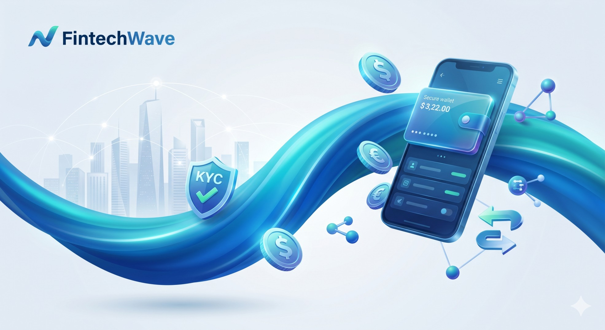
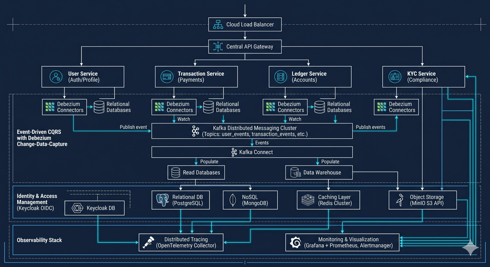

# FintechWave: Platform Overview

## Executive Summary

FintechWave is a secure, scalable, and enterprise-grade custodial e-money platform (modeled after the Orange Money operator model) designed to manage digital wallets, process real-time payments, and ensure robust regulatory compliance. Built on a modern microservices architecture, the platform provides an end-to-end ecosystem for customer onboarding, financial bookkeeping, risk management, and payment integrations.

---

## 🏗️ Technical Architecture & Stack

FintechWave is architected for maximum throughput, low latency, and zero data loss. It runs on a cutting-edge cloud-native stack:

*   **Runtime & Framework**: Java 21, Spring Boot 3, Spring Cloud Gateway
*   **Virtual Threads (Java Project Loom)**: Enabled system-wide (`spring.threads.virtual.enabled: true`) with customized executors for high-concurrency gRPC and Kafka message processing.
*   **Relational Datastore**: PostgreSQL 16 (Logical WAL replication enabled for CDC outbox relays).
*   **NoSQL read-models (CQRS)**: MongoDB (for real-time projection views) & Elasticsearch 8 (for fast reporting indexes).
*   **Caching & Coordination**: Redis 7 (used for velocity checks, rate-limiting, and ShedLock distributed locking).
*   **Message Broker**: Apache Kafka (KRaft mode) supporting transactional events and dead-letter queues.
*   **Data Ingestion (CDC)**: Debezium Kafka Connect (`debezium/connect:2.7.3.Final`) capturing outbox changes from Postgres WAL.
*   **Identity & Access Management**: Keycloak 26 (integrated OAuth2/OIDC provider).
*   **Object Storage**: MinIO (S3-compatible storage for KYC identity document verification).
*   **Observability Pipeline**: OpenTelemetry Collector, Prometheus (Metrics & Alerts), Grafana Loki (Structured logs), Grafana Tempo (Distributed tracing), and Grafana Dashboards.

---

## 💼 Core Business Capabilities

### 1. Identity & Compliance (KYC)
FintechWave takes a compliance-first approach to user onboarding:
*   **Tiered Onboarding**: Users progress through customizable verification tiers (Tier 0 to Tier 3), unlocking higher transaction limits as they provide verified identities.
*   **Secure Document Vault**: Identity documents (ID cards, selfie biometric photographs) are stored securely in MinIO, rendered via pre-signed, short-lived URLs.
*   **Automated Guards**: Digital wallets are strictly gated; no double-entry ledger accounts are provisioned until KYC verification is approved by an administrator.

### 2. Financial Core (The Double-Entry Ledger)
A mathematically sound bookkeeping core enforces absolute precision:
*   **Double-Entry Enforceability**: Every transaction requires matching debit and credit entries (`SUM(DEBIT) == SUM(CREDIT)`). Balances are never adjusted without an audit trail.
*   **Continuous Reconciliation**: The ledger compares total user liabilities against the platform float account, triggering immediate alerts on discrepancies.
*   **Two-Phase Transfers**: Fund transfers use a reserve-and-commit pattern (`RESERVED` -> `COMMITTED`), preventing double-spending and balance-locking issues.

### 3. Payment Gateway Integration
Bridges digital wallets to the fiat banking system:
*   **Cash-In / Cash-Out**: Integrated with Stripe for card deposits and bank withdrawals.
*   **Internal P2P**: Instant peer-to-peer balance transfers between onboarded users.
*   **Compensating Transactions**: DLT consumer triggers auto-refunds and rollbacks on failed payments.

### 4. Real-time Risk & Notifications
*   **Fraud Risk Engine**: Sliding-window velocity and volume rules process transaction events in real-time.
*   **Multi-Channel Alerts**: Automated email, SMS, and push notification dispatching with idempotent retry guarantees.

---

## 📊 Observability & Telemetry

FintechWave features a unified, correlation-linked observability stack managed via the OpenTelemetry collector:

*   **MDC Enrichment**: Traces (`traceId` and `spanId`) are propagated across gRPC boundaries, Kafka topics, and asynchronous threads using a centralized `BusinessContextMdc` helper.
*   **Structured Logs**: Ingested by **Grafana Loki** from the OTel pipeline.
*   **Distributed Traces**: Visualized in **Grafana Tempo**, allowing deep transaction performance profiling.
*   **System & JVM Metrics**: Collected by **Prometheus** with pre-configured rules in `alerts.yml` triggering warnings on SLA failures, consumer lag, or virtual thread pinning.
*   **Unified UI**: Explore metrics, logs, and traces in the **Grafana Dashboard** (Port 3000), secured via Keycloak single sign-on (SSO).

---

## 🚀 Running the Stack locally

### Prerequisites
*   Docker & Docker Compose (allocated with at least 8-16GB RAM)
*   Java 21 JDK & Maven 3.9+ (for building services)

### Step 1: Clone and Build
Build all packages and libraries using the parent Maven aggregator:
```bash
mvn clean install -DskipTests
```

### Step 2: Start Infrastructure & Observability
All infrastructure services (databases, brokers, observability collectors, and Keycloak) are launched via Docker Compose:
```bash
docker compose -f infra/docker-compose.yml up -d
```

### Step 3: Run Microservices
Services can be run locally using their Spring Boot maven profiles or packaged into docker images.

### Ports Registry

| Service | Port | Description |
| :--- | :--- | :--- |
| **API Gateway** | `8080` | Client entry-point |
| **Keycloak IAM** | `8180` | SSO Identity server |
| **Grafana** | `3000` | Observability Dashboard |
| **Prometheus** | `9090` | System metrics |
| **Loki** | `3100` | Log aggregation engine |
| **Tempo** | `3200` | Distributed trace visualizer |
| **Kafka Connect** | `8088` | Debezium CDC connector REST API |

---

## 📖 Master Documentation Directory

For deeper architectural details, refer to the project documentation:
*   [Master Development Plan & Decision Record](docs/FintechWaveDocs.md): In-depth system specifications, event schemas, port mappings, and development rules.
*   [Observability Implementation Plan](docs/observability_implementation_plan.md): OpenTelemetry collector pipeline design and log-trace correlation logs.
*   [Admin Dashboard Design](docs/admin_dashboard_design.md): Frontend architectural plan for Keycloak SSO, KYC review queues, and ledger control panels in Angular.
